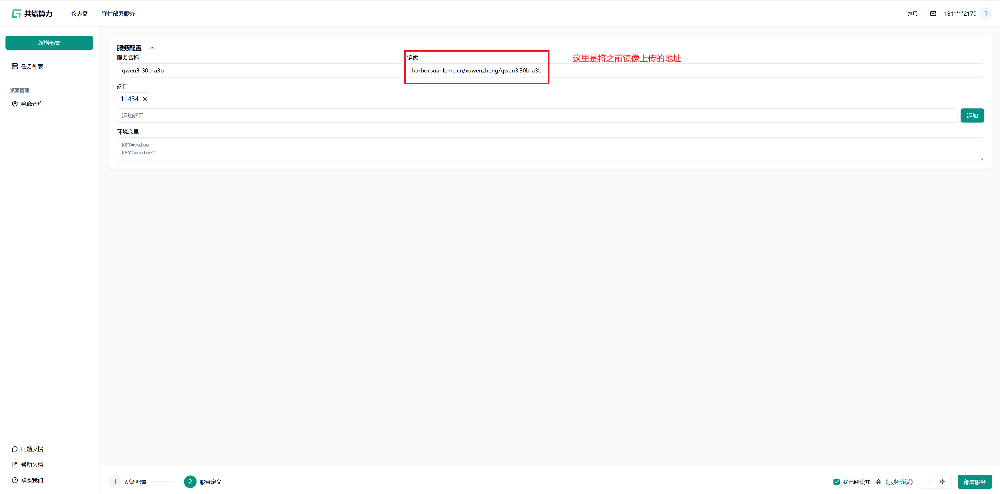

# llm-deployment
镜像打包与部署，支持ollama，vllm，lms等方式，自动部署到suanli.cn


## 镜像打包

### 环境准备

- 安装了Docker环境
- Git工具

### 打包Ollama镜像

- clone项目

```bash
git clone https://github.com/slmnb-lab/llm-deployment.git
```

- 修改 `ollama` 目录下的 `ollama_pull.sh` 文件中的模型名称。
> 模型列表参考 [Ollama官网](https://ollama.com/library)

```bash
#!/bin/bash
ollama serve &
sleep 15
ollama pull qwen3:30b-a3b  # 替换成你需要的模型

```

 - 修改  `ollama` 目录下的 `compose.yml` 文件中的模型名称。
 > 开始之前需要在suanli.cn中创建一个镜像仓库，镜像仓库名称为 `qwq`，镜像标签为 `30b-a3b`。访问这里 [初始化镜像仓库](https://console.suanli.cn/serverless/image)

> harbor.suanleme.cn/xuwenzheng/qwen3:30b-a3b 是suanli.cn中创建的镜像仓库地址，这个参数在部署服务的时候会用到，记得替换成你的镜像仓库地址。

```yaml

services:
  qwq:
    image: harbor.suanleme.cn/xuwenzheng/qwen3:30b-a3b  ## 这里是suanli.cn中创建的镜像仓库地址  harbor.suanleme.cn 是仓库地址 xuwenzheng 是账号名称 qwen3 是镜像名称 30b-a3b 是镜像标签
    build: .
    labels:
      - suanleme_0.http.port=11434          # 这里是ollama运行的端口，不要修改
      - suanleme_0.http.prefix=qwen332b     # 这里是发布到的suanli.cn的回传域名
    restart: unless-stopped
    deploy:
      resources:
        reservations:
          devices:
            - driver: nvidia
              count: all
              capabilities: [gpu]
    ports:
      - "11434:11434"                        # 这里是ollama运行的端口，不要修改

```

- 运行打包脚本

```bash
cd llm-deployment/ollama   # 进入ollama目录
docker compose build       # 打包镜像
```


### 打包Ollama和Open WebUI镜像

- clone项目

```bash
git clone https://github.com/slmnb-lab/llm-deployment.git
```

- 修改 `ollama-webui` 目录下的 `start.sh` 文件中的模型名称。
> 模型列表参考 [Ollama官网](https://ollama.com/library)

```bash
#!/usr/bin/env bash

SCRIPT_DIR=$( cd -- "$( dirname -- "${BASH_SOURCE[0]}" )" &> /dev/null && pwd )
cd "$SCRIPT_DIR" || exit

# 启动ollama服务
ollama serve &

# 等待ollama服务启动
until curl -s http://localhost:11434 > /dev/null; do 
    echo 'Waiting for Ollama service to start...'; 
    sleep 1; 
done

# 等待ollama服务启动完成
sleep 15

# 设置默认模型
DEFAULT_MODEL=${DEFAULT_MODEL:-qwen3:30b-a3b}  ## 这里替换为你需要打包的模型，默认为qwen3:30b-a3b

```

 - 修改  `ollama-webui` 目录下的 `compose.yml` 文件中的模型名称。
 > 开始之前需要在suanli.cn中创建一个镜像仓库，镜像仓库名称为 `{yourusername}`，镜像标签为 `30b-a3b`。访问这里 [初始化镜像仓库](https://console.suanli.cn/serverless/image)

> harbor.suanleme.cn/{yourusername}/qwen3:30b-a3b 是suanli.cn中创建的镜像仓库地址，这个参数在部署服务的时候会用到，记得替换成你的镜像仓库地址。

```yaml

services:
  ollama-webui-qwen3:
    image: harbor.suanleme.cn/{yourusername}/ollama-webui-qwen3:30b-a3b  ## 这里是suanli.cn中创建的镜像仓库地址  harbor.suanleme.cn 是仓库地址 {yourusername} 是账号名称 ollama-webui-qwen3 是镜像名称 30b-a3b 是镜像标签
    build: .
    labels:
      - suanleme_0.http.port=11434                   # 这里是ollama运行的端口，不要修改
      - suanleme_0.http.prefix=llama-webui-qwen3     # 这里是发布到的suanli.cn的回传域名
    restart: unless-stopped
    deploy:
      resources:
        reservations:
          devices:
            - driver: nvidia
              count: all
              capabilities: [gpu]
    ports:
      - "11434:11434"                        # 这里是ollama运行的端口，不要修改

```

- 运行打包脚本

```bash
cd llm-deployment/ollama-webui   # 进入ollama目录
docker compose build       # 打包镜像
```


### 打包 `vllm` 和 `Qwen3-32B` 模型镜像

- clone项目

```bash
git clone https://github.com/slmnb-lab/llm-deployment.git
```


- 修改 `vllm` 目录下的 `dockerfile` 文件中的模型名称。
> 模型列表参考 [魔搭社区](https://modelscope.cn/models)

```dockerfile

FROM vllm/vllm-openai:v0.8.5

# 安装必要的依赖
RUN uv pip install --system vllm[audio]==0.8.5

# 创建模型目录
RUN mkdir -p /root/models/Qwen/Qwen3-32B

# 复制模型文件到镜像中
ADD ./models/Qwen/Qwen3-32B /root/models/Qwen/Qwen3-32B

# 设置工作目录
WORKDIR /models

# 设置环境变量
ENV MODEL_PATH=/root/models/Qwen/Qwen3-32B
ENV TENSOR_PARALLEL_SIZE=1

# 暴露默认的 OpenAI API 端口
EXPOSE 8000

# 启动命令
CMD ["--model", "/root/models/Qwen/Qwen3-32B", \
     "--host", "0.0.0.0", \
     "--tensor-parallel-size", "$TENSOR_PARALLEL_SIZE", \
     "--port", "8000"]

```

 - 修改  `vllm` 目录下的 `compose.yml` 文件中的模型名称。
 > 开始之前需要在suanli.cn中创建一个镜像仓库，镜像仓库名称为 `{yourusername}`，镜像标签为 `32b`。访问这里 [初始化镜像仓库](https://console.suanli.cn/serverless/image)

> harbor.suanleme.cn/{yourusername}/qwen3-vllm:32b 是suanli.cn中创建的镜像仓库地址，这个参数在部署服务的时候会用到，记得替换成你的镜像仓库地址。

```yaml

services:
  Qwen3-vllm:
    image: harbor.suanleme.cn/{yourusername}/qwen3-vllm:32b
    build: .
    labels:
      - suanleme_0.http.port=8000
      - suanleme_0.http.prefix=qwen3-vllm
    restart: unless-stopped
    deploy:
      resources:
        reservations:
          devices:
            - driver: nvidia
              count: all
              capabilities: [gpu]
    ports:
      - "8000:8000"


```

- 安装modelscope 工具
> 具体步骤参考：
  - [环境安装](https://modelscope.cn/docs/intro/quickstart)
  - [模型下载](https://modelscope.cn/docs/models/download)

- 下载模型
执行以下命令，执行完毕之后，模型默认会下载到目录：/root/.cache/modelscope/hub/models

```bash
 modelscope download --model Qwen/Qwen3-32B

 ## 执行完毕之后，模型默认会下载到目录：/root/.cache/modelscope/hub/models

```

- 切换到模型下载所在的目录
> 以ubuntu操作系统为例，目录在`/root/.cache/modelscope/hub/models`
> windows系统用户在 `C:\Users\{youros username}\.cache\modelscope\hub\models`

```bash
cd /root/.cache/modelscope/hub/models

## 将git仓库中的文件复制到当前目录
cp {yourdir}/llm-deployment/vllm/dockerfile .
cp {yourdir}/llm-deployment/vllm/compose.yml .

```

- 运行打包脚本

```bash
cd /root/.cache/modelscope/hub/models   # 进入ollama目录
docker compose build       # 打包镜像
```

## 镜像上传
将打包的镜像上传到suanleme.cn

- 登录镜像仓库
```bash
docker login harbor.suanleme.cn --username=xuwenzheng

## 输入密码
*******

```

- 上传镜像
```bash
## 为新生成的镜像打上标签
docker tag harbor.suanleme.cn/xuwenzheng/qwen3:30b-a3b harbor.suanleme.cn/xuwenzheng/qwen3:30b-a3b

## 上传镜像
docker push harbor.suanleme.cn/xuwenzheng/qwen3:30b-a3b
```


## 部署服务
点击这里 [部署服务](https://console.suanli.cn/serverless/create/idc) ，登录后根据页面提示进行部署。

- 选择合适的GPU

- 设置镜像仓库地址 和 访问域名的前缀



## 路线图

- [x] 支持Ollama
- [] 支持VLLM
- [] 支持LMS
